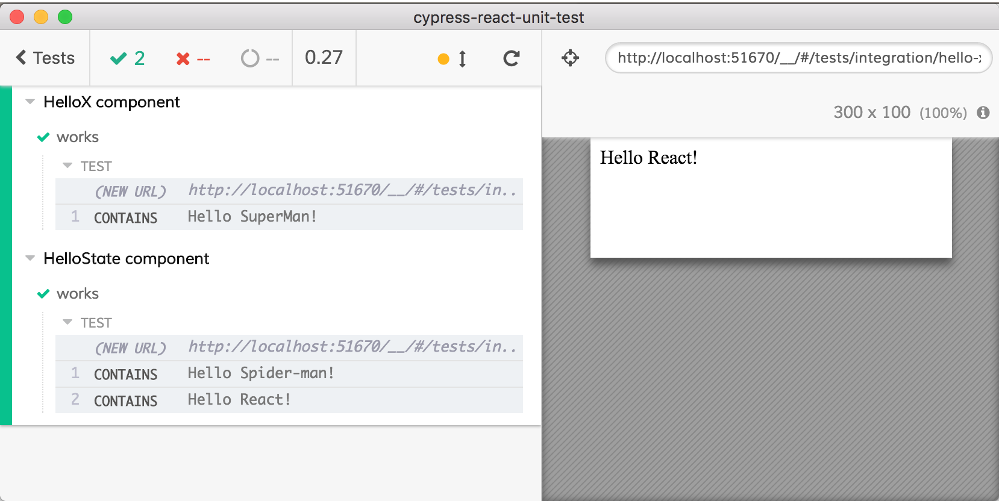

# cypress-react-unit-test [](https://travis-ci.org/bahmutov/cypress-react-unit-test)

> Unit test React components using Cypress

## Use

```js
// import the component you want to test
import { HelloState } from '../../src/hello-x.jsx'
import React from 'react'
import { mount } from 'cypress-react-unit-test'
describe('HelloState component', () => {
  it('works', () => {
    // mount the component under test
    mount(<HelloState />)
    // start testing!
    cy.contains('Hello Spider-man!')
    // mounted component is returned from Cypress.component()
    Cypress.component().invoke('setState', {name: 'React'})
    Cypress.component().its('state').should('deep.equal', {
      name: 'React'
    })
    // check if GUI has rerendered
    cy.contains('Hello React!')
  })
})
```



## Examples

All components are in [src](src) folder. All tests are in [cypress/integration](cypress/integration) folder.

* [hello-world-spec.js](cypress/integration/hello-world-spec.js) - testing the simplest React component from [hello-world.jsx](src/hello-world.jsx)
* [hello-x-spec.js](cypress/integration/hello-x-spec.js) - testing React component with props and state [hello-x.jsx](src/hello-x.jsx)
* [counter-spec.js](cypress/integration/counter-spec.js) clicks on the component and confirms the result
* [stateless-spec.js](cypress/integration/stateless-spec.js) shows testing a stateless component from [stateless.jsx](src/stateless.jsx)
* separate repo [bahmutov/calculator](https://github.com/bahmutov/calculator) tests multiple components